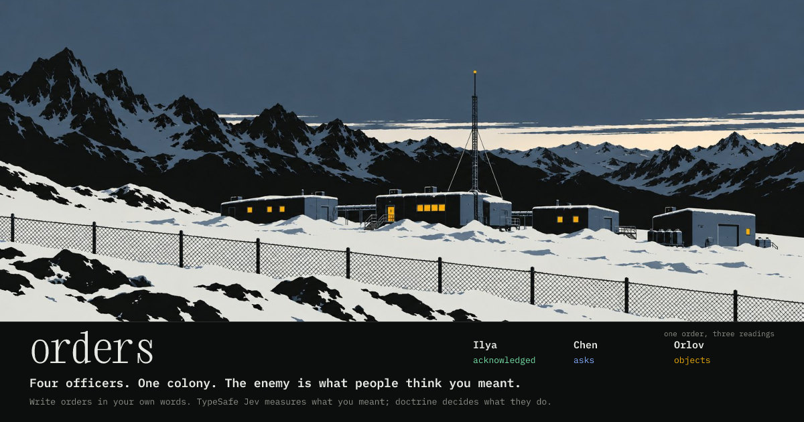

# orders

A command game where the enemy is what people think you meant.

You are the senior authority of Vesper Station, a colony of 184 people on a cold plateau, for fourteen days after its systems failed. You do not click actions. You write orders, up to three a day, to four officers. A System One model, [TypeSafe Jev](https://typesafe.ai), measures each order once, in one request of about fifty typed questions: what it asks for, who it is for, what it puts first, what it forbids or permits, how clear it is. Every officer receives the same measurement. Their differences are numbers: doctrine. Each picks one action from a finite library by an explicit utility, the chosen actions compete for fuel, trucks, crew hours and medicine, the world runs through the night, and in the morning you read what each of them thought you meant.

Live: https://orders.asfarlab.fun



```
O-6-1 · you
Get Sector B evacuated before dark. Use whatever vehicles are available, but keep
enough fuel for the water pumps tonight. Security should cover the evacuation
instead of chasing whatever is outside.

Captain Ilya   acknowledged   Clear enough for me. Moving out.
Chen           priority noted A stated priority. Thank you. I can allocate now.
Chief Orlov    objects        Complying. Please read the fuel line tomorrow.
                              = complies, but the action works against preserve reserve

Night 6 · cold · -14 C
Captain Ilya: escort the evacuation
Chen: reserve fuel for the pumps · 100%
Chief Orlov: power to the pumps
Security walked 16 colonists from habitat to the core.
10 fuel held back for the pumps tonight.
Pumps ran on fuel.
```

## How it works

1. **Judge** (`src/judge/questions.ts`). One request per order. The state is small and exact: the order, the day, one line per active crisis, one sentence per resource with the numbers that matter to precedence, the active standing orders, the last four orders, and any question an officer is waiting on. The questions are three Choices (objective, sector, timeframe), forty Nouls (which departments it concerns, eleven priorities, twelve constraints, thirteen facts about the wording), six Scores (urgency, risk tolerance, resource flexibility, specificity, clarity, delegated discretion), two Nouls per active standing order (does this break it, does this set it aside) and one per pending clarification (does this answer it). Jev returns probabilities, not prose, in about 400 ms.
2. **Officers** (`src/engine/resolve.ts`, `src/content/officers.ts`, `src/content/actions.ts`). Each department has a finite action library. For each action the officer adds up: objective match, stated priorities weighted by their doctrine (Vale multiplies anything about lives by 1.6, Orlov anything about machines by 1.5, Chen anything about stock by 1.45, Ilya urgency by 1.4), constraints honoured or violated weighted by literalness, a penalty for acting without a permission the order did not give, urgency times the action's speed, risk times risk aversion, whether the order named the right sector, discretion, standing orders in their scope, what the department has learned the commander wants, and their own initiative about the crisis in front of them. Every term is recorded and shown.
3. **Clarification** is an action. When the need to ask (low clarity, an unspecified target, a contradiction, two resources with no precedence, a standing order or a precedent in the way) crosses a line that depends on literalness and initiative, the officer asks an authored question and holds to routine until it is answered. Chen asks; Ilya guesses.
4. **The world** (`src/engine/world.ts`, `src/content/crises.ts`). Power decides heat, heat decides pipes and injuries, fuel decides power and pumps and trucks, pumps decide water, medicine and a warm ward decide who lives. Thirty crisis templates are gated by state and drawn by the seed. Every change to the world is an effect with a cause and a sentence.
5. **Memory** (`src/engine/orders.ts`, `src/engine/trust.ts`). An order that sets a rule becomes a standing order with its own measurement vector. Every order teaches each department a decayed average of the priorities it stated. Trust moves by rules and changes how willing an officer is to read intent, to ask, and to lean on precedent.

The engine is deterministic: a run is a seed plus the stream of `(order, measurements)`, and replaying it reproduces every action, allocation, casualty, line and ending. That is the save format, the test fixture format and the replay view.

## The officers

| | doctrine | lesson |
| --- | --- | --- |
| Captain Ilya, security | initiative .90, literalness .45, risk aversion .25 | Never say "whatever it takes" unless you mean it. |
| Chen, logistics | literalness .92, resource caution 1.45, initiative .45 | Say which resource comes first, or she asks and waits. |
| Dr Vale, medical | life priority 1.60, initiative .70 | If medicine must last, tell her directly. |
| Chief Orlov, engineering | infrastructure 1.50, precedent .80 | Hears "keep the colony alive" as "keep the systems alive". |

## Calibration

`npm run calibrate` runs forty-six authored orders (clear, vague, contradictory, conditional, absolute, precedent-conflicting, prompt-injecting) through the real question set at a fixed day-six situation, grades every answer against the engine's thresholds, and writes [docs/CALIBRATION.md](docs/CALIBRATION.md) with per-question pass rates, high-versus-low separation and repeat-run drift. Question wording is fixed until the corpus passes; thresholds are not tuned to the wording. The batch simulator, `npm run sim`, runs seeded games with scripted commanders and no model calls to measure endings, deaths, clarification frequency and action diversity.

## Presentation

Nothing is generated while the game runs. Everything below is produced once by a script and committed, with prompts and provenance in `public/art/PROMPTS.md` and `public/audio/PROMPTS.md`.

- **Portraits and key art**: gpt-image-2.5-sunburst, one style reference then edits (`scripts/art.py` post-processes).
- **Voice**: Gemini TTS, one clip per authored line, 184 clips (`npm run voice`).
- **Sound**: ElevenLabs text-to-sound-effects, twelve cues (`npm run sfx`).
- **Music**: Lyria 3.5, three tracks: title, day, night (`npm run music`).

## Stack

- Cloudflare Workers with static assets, via `@cloudflare/vite-plugin`
- React 19, Vite, TypeScript, Vitest
- `@typesafe-ai/sdk` for the model calls, server-side only
- Cloudflare Turnstile once per run, then a signed session token; per-session and per-IP rate limits

The model key never reaches the browser. The browser runs the engine, builds the compact judge state, and calls the Worker, which replaces the fixed descriptions with its own, attaches the question set, calls Jev and returns measurements.

## Development

```bash
npm install
cp .dev.vars.example .dev.vars   # then put your TYPESAFE_API_KEY in it
npm run dev                      # http://localhost:5173
npm test
npm run typecheck
```

`.dev.vars` uses Cloudflare's always-pass Turnstile test keys. Regenerating assets needs the respective keys in the environment: `OPENAI_API_KEY` for portraits, `GEMINI_API_KEY` for `npm run voice` and `npm run music`, `ELEVENLABS_API_KEY` for `npm run sfx`. `npm run calibrate` needs `TYPESAFE_API_KEY`.

## Documents

- [docs/ORDERS_SPEC.md](docs/ORDERS_SPEC.md): the intended full game.
- [docs/DECISIONS.md](docs/DECISIONS.md): what was decided and why.
- [docs/PLAN.md](docs/PLAN.md): construction order.
- [docs/CALIBRATION.md](docs/CALIBRATION.md): the latest calibration report.

MIT.
